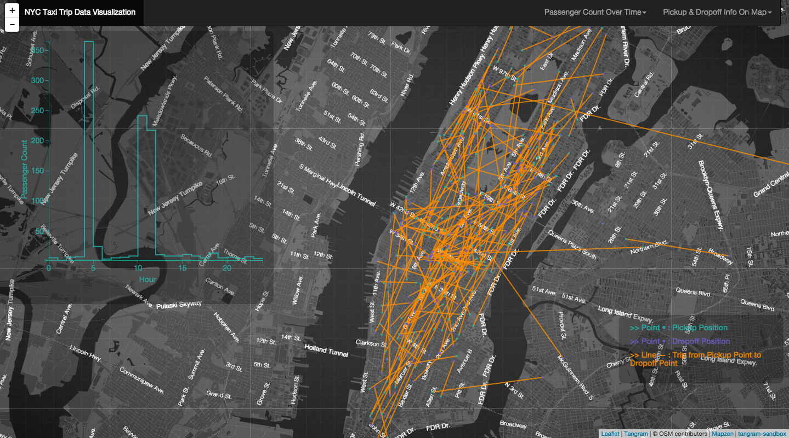

* [data-map](https://github.com/faustineinsun/data-map) (Node.js, MySQL, Redis, R): 
    * applied machine learning algorithms **XGBoost**, **Random Forest**, and **Deep Learning (H2O)** on preprocessed Yelp data, in order to help each Yelp’s business discovers the probability that clients would like to check-in on a certain day in week
    * website address: [https://data-map.herokuapp.com](https://data-map.herokuapp.com)      
       

* [WiseCrowdRec](https://github.com/faustineinsun/WiseCrowdRec) (**Spring MVC** + **Tomcat** + **Spark Streaming** + **Apach Storm** + **RabbitMQ** + **WebSockets**)
    * mining and learning streaming tweets 

* 2nd version of WiseCrowdRec (**Node.js** + **Spark Streaming** + **Socket.io**)
    * [demo video](https://drive.google.com/file/d/0B-OcoMYLimAlcWdBZHFRRHR5Y2c/view) (< 1 minute) 
    * website address: [www.wisecrowdrec.com](http://www.wisecrowdrec.com/)

* [NYC Taxi Trip Data Visualization](https://github.com/faustineinsun/taxi-info) (Django, Python, Heroku): 
    * website address: [https://taxi-info.herokuapp.com](https://taxi-info.herokuapp.com)      
       

